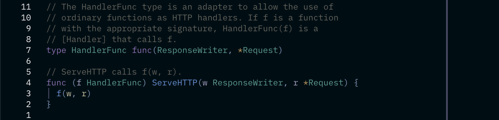
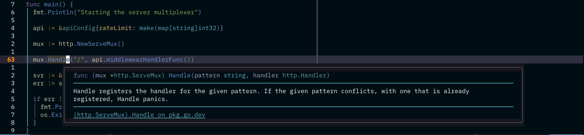

# Introduction

I just started learning Go last week and it has been a great experience. While studying the standard http module I came across a new concept of adapters that I had never encountered in another language until now. In this small article I will talk about this pattern and show a use case example of a rate limit.

## Adapters

In Go we can use adapters in a clever technique that lets us implement `interfaces` in `functions`. This allows functions to be treated as objects. We can see this being done for example by the `HandleFunc` of the http module that adapts any given function handler to act as an implementation of the Handler interface, needed by a server multiplexer e.g.



To satisfy an interface implementation a struct is not needed. In this situation, we can think of functions as objects to avoid declaring a complex or an empty struct to implement just one method.
This can be done because Go doesn't have a strict OOP structure, we can bind methods to types by just informing the receiver of a function (it has to be a local type, we can't define a method for a int32 type e.g).

```Go
func (receiver MyReceiverType) myFunction(){
  // ... something
}
```

In this case we bound `myFunction` declaration to the MyReceiverType. In this case we are passing the receiver as a copy, if we would like to change it we would need to pass a pointer to be de referenced.

### HTTP Handler interface

```Go
// The handler interface
type Handler interface {
  ServeHTTP (ResponseWriter, *Request)
}
```

```Go
// HandlerFunc implementation
type HandlerFunc func (ResponseWriter, *Request)

func (f HandlerFunc) ServeHTTP (w ResponseWriter, r *Request) {
  f(w,r)
}
```

In this code we can see that the `HandlerFunc` type satisfies the Handler interface implementation and we can use this to use functions as HTTP handlers.

### Rate Limit example

In this example we will have an struct API to track HTTP calls in a map (just an example). To safely write and read from the map I will be using a RWMutex, since each new http request is handled in a go routine we need this safety of shared state between them.

#### Struct and methods declaration

```Go
type apiConfig struct {
 rateLimit map[string]int
 mux       *sync.RWMutex
}

// Method to wrap an example response
func (api apiConfig) SendResponse(w http.ResponseWriter, req *http.Request) {
 message := "API Call"
 w.Write([]byte(message))
}

// Rate limit middleware
func (api *apiConfig) middlewareHandlerFunc() http.Handler {
 return http.HandlerFunc(func(w http.ResponseWriter, req *http.Request) {
  ip, _, err := net.SplitHostPort(req.RemoteAddr)

  if err != nil {
   // error handling
  }

  api.mux.RLock()
  n := api.rateLimit[ip]
  fmt.Printf("IP %s has reached to the API %d times\n", ip, n)
  api.mux.RUnlock()

  switch {
  case n == 0:
   api.mux.Lock()
   api.rateLimit[ip] = 1
   api.mux.Unlock()
   api.SendResponse(w, req)
   return // We don't actually need an return because of the way the http module handles responses but I consider it a good practice

  case n > 10:
   http.Error(w, "Rate limit reached", http.StatusTooManyRequests)
   return

  default: // 1 ≤ count ≤ 10
   api.mux.Lock()
   api.rateLimit[ip] = n + 1
   api.mux.Unlock()
   api.SendResponse(w, req)
   return
  }
 })
}
```

In the `middlewareHandlerFunc` we just check if the request sender IP has reached our defined limit and if it has, we return an error message. RWMutex allows concurrent read access (RLock()) while ensuring exclusive write access (Lock()), improving performance under high read loads. In this example I could've used sync.map but I choose not to for learning reasons.

### HTTP Server

In our http server we are using a Serve Multiplexer to address our routes and start a server. We can see that our adapter worked because we are using our `middlewareHandlerFunc` and attaching it's return to a mux.Handle, that expects a string and a http.Handler.



```Go
func main() {
 fmt.Println("Starting the server multiplexer")

 api := &apiConfig{
  rateLimit: make(map[string]int),
  mux:       &sync.RWMutex{},
 }

 mux := http.NewServeMux()

 mux.Handle("/", api.middlewareHandlerFunc())

 svr := &http.Server{Addr: ":8080", Handler: mux}
 err := svr.ListenAndServe()

 if err != nil {
  fmt.Println(err)
  os.Exit(1)
 }
}
```

#### Complete code

```Go
package main

import (
 "fmt"
 "net"
 "net/http"
 "os"
 "sync"
)

type apiConfig struct {
 rateLimit map[string]int
 mux       *sync.RWMutex
}

func (api apiConfig) SendResponse(w http.ResponseWriter, req *http.Request) {
 message := "API Call"
 w.Write([]byte(message))
}

func (api *apiConfig) middlewareHandlerFunc() http.Handler {
 return http.HandlerFunc(func(w http.ResponseWriter, req *http.Request) {
  ip, _, err := net.SplitHostPort(req.RemoteAddr)

  if err != nil {
   // error handling
  }

  api.mux.RLock()
  n := api.rateLimit[ip]
  fmt.Printf("IP %s has reached to the API %d times\n", ip, n)
  api.mux.RUnlock()

  switch {
  case n == 0:
   api.mux.Lock()
   api.rateLimit[ip] = 1
   api.mux.Unlock()
   api.SendResponse(w, req)
   return

  case n >= 10:
   http.Error(w, "Rate limit reached", http.StatusTooManyRequests)
   return

  default: // 1 ≤ count ≤ 10
   api.mux.Lock()
   api.rateLimit[ip] = n + 1
   api.mux.Unlock()
   api.SendResponse(w, req)
   return
  }
 })
}

func main() {
 fmt.Println("Starting the server multiplexer")

 api := &apiConfig{
  rateLimit: make(map[string]int),
  mux:       &sync.RWMutex{},
 }

 mux := http.NewServeMux()

 mux.Handle("/", api.middlewareHandlerFunc())

 svr := &http.Server{Addr: ":8080", Handler: mux}
 err := svr.ListenAndServe()

 if err != nil {
  fmt.Println(err)
  os.Exit(1)
 }
}
```

## Conclusion

I hope you've found the article useful for you and have learned something from it! Let me know your thoughts!
