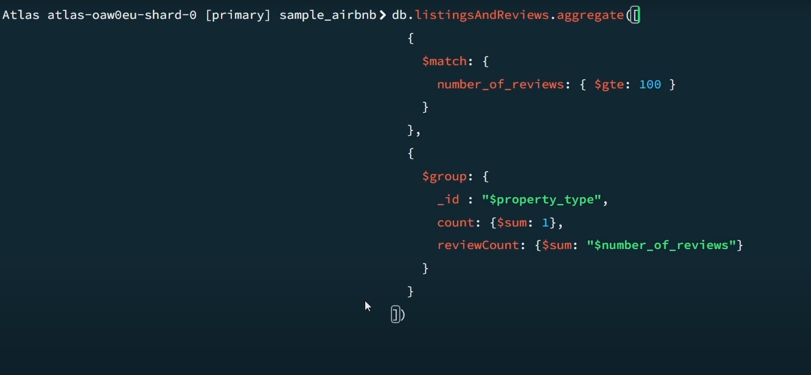

# Aggregation Pipelines

Similar to operations such as `GROUP BY` in SQL data bases by defining some
steps into our aggregation process.

## Example

The order of grouping and matching does matter, aggregate accepts a array of
objects so we must take into consideration.
