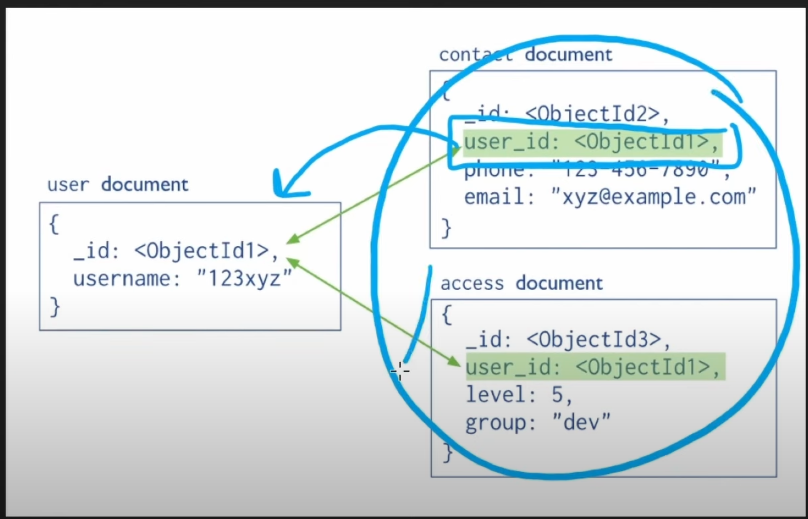
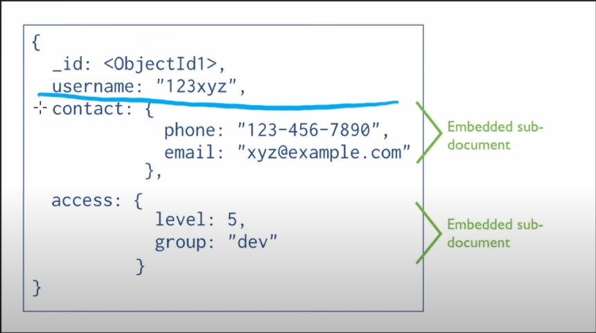

# When to use?

## Linking

- If the embedded data is not used very frequently it maybe a good idea to link it
  using the ObjectID from another collection.
- If the embedded data is updated a lot.

## Embedding

If the embedded data is used very frequently it maybe a good idea to place it,
embed it into a single document.

