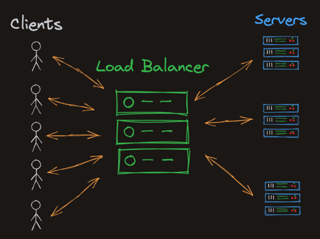

# Load Balancers

[[vertical and horizontal scaling|Horizontal Scaling strategy]] for balancing servers operations.

The load balancer doesn't do any real work, it just centralizes and sends the
processing work to other server when it arrives. It only routes the requests
into server/client.



In this strategy the load balancer will always send the processing for a server
that has CPU not being used for any processing.

## How to configure a load balancer in docker

We have introduced in networks with docker how to create a network, a custom
bridge to connect containers to it, now we will use `Caddy` to implement a load
balancer.

We have two containers called caddy1 and caddy2, each running on a specific port
and we will use the `rounde robin` algorithm to make a reverse proxy in our load
balancer.

```terminal
docker run --network caddytest -p 8080:80 -v $PWD/Caddyfile:/etc/caddy/Caddyfile caddy
```

In this run we matched port 8080 on the local host to port 80 on the application
and we found the Caddyfile inside our root application directory then used the
caddy image to run.

Caddyfile to listen to in the port 80

```txt
localhost:80

reverse_proxy caddy1:80 caddy2:80 {
 lb_policy      round_robin
}
```

What happens now is that when we access the port 8080 on our local machine the
Caddy web server will intercept the connection with a proxy configured by the
`Caddyfile` and by using the round robin algorithm it will forward the connection
to the available container.

- [~] link Cloud Fare: <https://www.cloudflare.com/pt-br/learning/performance/types-of-load-balancing-algorithms/>
