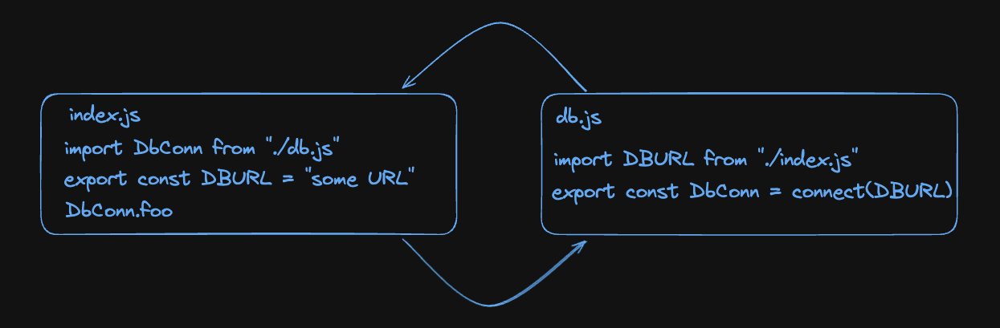

# Module imports in node.js

Imports in general are one of the most basic programming language features. Most of the languages support it for us to follow the DRY (don't repeat yourself) principle.

Particularly in developing web applications in node.js, we can sometimes make mistakes about simple imports, and that's going to be covered in this short article.

## Understanding how imports work

1. First, node will hoist all imports on a file, regardless of they're position in
   the codebase, for all files, follwoing the import flow. It's called the `parsing phase`.
2. After that it will have built a `dependency graph` and will execute the code
   in the order it was defined. The graph is not necessarily the order of the imports of the
   files.

## Circular dependency

Because of import hoisting we can come across the `circular dependencies`
problem. This often happens when we try to access a exported module declared in a module
that depends on the main module. I know that sounded a little bit hard to
understand, but I will clear this out.



In this example `index.js` exports a database connection URL to be used in the
`db.js` file and the main module itself utilizes the `database connection`
established in the db.js file. This clearly creates a circular dependency flow between
them and this causes an error of use before initialization of `DBURL variable`.

### Solution

In this case the solution is very clear, we could just initialize the `DBURL`
variable inside of our centralized database module, and that's the reason we
often centralize some specific cores of our applications in dedicated
configuration files. This example was just purely designed for a simple explanation.

## Config files

`Configuration files` are the main solution for this module importing confusion.
A most appropriate example of a config file usage would be the following one.

In this example, a AWS S3 connection is being established and it will be used by
our main module `index.js` and inside a get request `route.js`.

### Main module

```JavaScript
// index.js
import someRoute from "./route.js"

export const s3client = new S3Client({
  region: "s3 region",
  credentials: {
    accessKeyId: process.env.ACCESS_KEY,
    secretAccessKey: process.env.SECRET_ACCESS_KEY
  }
});

// express http server setup...
```

### Route module

```JavaScript
// route.js
import s3client from "./index.js"
import { Router } from "express";

const router = new Router();
router.get("get-URL", async (req, res) => {
  const foo = await s3client.bar;
  return res.status(code)
});

export default router;
```

### Quick fix

We could just have started the S3 connection in a configuration file and import it
when the module is required for some operation, solving our problem.

```JavaScript
// s3.js
export const s3client = new S3Client({
  region: "s3 region",
  credentials: {
    accessKeyId: process.env.ACCESS_KEY,
    secretAccessKey: process.env.SECRET_ACCESS_KEY
  }
});
```

## Conclusion

This was a quick article about circular dependency loops that some times we can
encounter while working with modules in node.js. Hope you find it use full!
